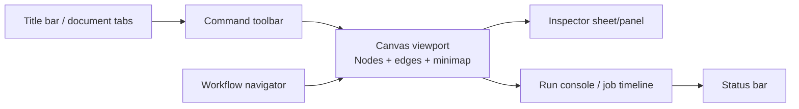

# Flowz Canvas Editor — GPUI Kit Blueprint

**สถานะ:** Proposed

**วันที่:** 2026-09-21

**เป้าหมาย:** เพิ่ม desktop TUI/GUI แบบ native ด้วย GPUI Kit ให้ `flowz` เป็น workflow canvas editor ที่สร้าง ตรวจสอบ รัน และติดตาม workflow ได้จากโมเดลเดียวกับ orchestration engine เดิม

## 1. ขอบเขตและหลักการออกแบบ

### งานหลักของผู้ใช้

ผู้ใช้ต้องสามารถ **วางโครง workflow, แก้พารามิเตอร์, ตรวจความถูกต้อง, สั่งรัน และติดตามผลลัพธ์ของ job** ได้โดยไม่ต้องแปลงไปมาระหว่าง JSON, MCP call และ log โดยตรง

อ็อบเจ็กต์หลักคือ `WorkflowDocument` ซึ่งเป็น representation สำหรับการแก้ไขของ `RunRequest` และมี `NodeId`/`EdgeId` สำหรับตำแหน่งบน canvas โดยไม่เปลี่ยน domain contract ของ engine จนกว่าจะมีเหตุผลทาง API ที่ชัดเจน

หลักการจาก GPUI Kit Design Guides ที่ใช้กับหน้าจอนี้:

- **Canvas เป็นพื้นที่ทำงานหลัก** ไม่ใช่ภาพประกอบของ dashboard; ให้พื้นที่และลำดับสายตากับการจัด workflow มากที่สุด
- ใช้ shell แบบ **document workspace + resizable inspector**: title bar/toolbar, canvas กลาง, inspector ด้านขวา, status bar ด้านล่าง
- ใช้ token จาก `cx.theme()` และ spacing/radius ของระบบ ห้ามฝังสีหรือ geometry แบบ raw ใน feature code
- คำสั่งในแอปใช้ `Button`/`Action`; `Link` ใช้เฉพาะ URL หรือ resource ภายนอก
- ทุกสถานะต้องมองเห็นได้: selection, focus, hover, running, success, warning, failed, disabled, loading, read-only
- Canvas interaction ที่เป็นพฤติกรรมใหม่จึงค่อยทำ custom element; menu, dialog, sheet, input, select และ command palette ใช้ component มาตรฐาน
- Canvas ต้องใช้งานได้ด้วย keyboard ทั้งหมด ไม่ให้ hover เป็นช่องทางเดียวของคำสั่งสำคัญ

## 2. ภาพรวมหน้าจอ



### 2.1 Window shell

| Region | บทบาท | สัดส่วนเริ่มต้น | ข้อจำกัด |
|---|---|---:|---|
| Title bar/document strip | ระบุ workflow ปัจจุบัน, dirty state, window commands | สูงตาม platform | ไม่แย่งพื้นที่จาก canvas |
| Command toolbar | Save, Validate, Run, Stop/Cancel, Undo/Redo, Add node, Zoom | 1 แถว | คำสั่งหลักต้องยังเห็นเมื่อแคบ |
| Workflow navigator | รายการ node แบบลำดับ/โครงสร้าง, search, filter status | 240–300 px | min 200 px; collapse ได้ |
| Canvas viewport | วาง node, เชื่อม edge, เลือก, pan, zoom, inspect | flex 1 | min 480 px; เป็น primary task |
| Inspector | แก้ property ของ selection; แสดง validation | 320–420 px | min 280 px; ปิดได้ |
| Run console | job status, todos, findings, artifacts, logs แบบสรุป | 180–280 px เมื่อเปิด | เปิดเป็น bottom sheet/panel ไม่ overlay canvas โดย default |
| Status bar | dirty/saved, validation summary, zoom, connection/runtime state | สูงคงที่ | ใช้สถานะสั้นและไม่เป็นที่ซ่อนคำสั่ง |

เมื่อหน้าต่างแคบ: คง canvas และ toolbar ไว้ก่อน, collapse navigator, ย้าย inspector เป็น `Sheet`, ย้ายคำสั่งรองเข้า `DropdownMenu`, และให้เฉพาะ canvas/console เป็น scroll owner ของตนเอง ห้ามให้ทั้งหน้าต่าง scroll รวมกัน

## 3. Canvas visual grammar

### 3.1 Node types

Node แต่ละชนิดต้องมี domain ID ที่เสถียรและชื่อที่อ่านได้บน canvas:

| Node | Mapping | หน้าที่ |
|---|---|---|
| **Item** | `WorkflowItem` | งานย่อยหนึ่งรายการ: `brief`, `prompt`, files, sandbox, effort, budgets |
| **Reducer** | `ReducerSpec` | รวมผลจาก item IDs เป็นผลลัพธ์เดียว |
| **Run policy** | `RunRequest` fields | mode, failure policy, concurrency, confirmation, run budget |
| **Cron trigger** | `CronDefinition` | จุดเริ่มตามเวลา; แสดงเป็น trigger badge/edge เข้าสู่ workflow |
| **Job** | `JobResult` + `JobState` | read-only runtime projection หลัง run; ไม่ใช่แกนแก้ไขถาวร |

Node มีโครงสร้าง 3 ชั้น: header (icon + title + status), body (ข้อมูลตัดทอนที่จำเป็นต่อการตัดสินใจ), footer (ports/summary/quick state) การ์ดไม่ควรซ้อนการ์ด และไม่ใช้ badge ทุก field

สีสถานะเป็น semantic token เท่านั้น และต้องมีสัญลักษณ์/ข้อความร่วมด้วย:

- pending: muted + `Pending`
- running: info + `Running`
- completed: success + `Completed`
- failed: danger + `Failed`
- blocked/validation: warning + ข้อความสาเหตุ

### 3.2 Edge semantics

- เส้นทึบ: data/dependency edge
- เส้นประ: trigger/control edge
- selected edge: focus ring/line emphasis ที่แตกต่างจาก hover
- invalid edge: danger/warning token + inline finding; ห้ามใช้สีอย่างเดียว
- edge label ใช้เมื่อมีความหมายจริง เช่น reducer input หรือ failure path

### 3.3 Canvas controls

คำสั่งที่ต้องเห็นหรือเข้าถึงได้โดยไม่พึ่ง hover: `Add node`, `Validate`, `Run`, `Fit view`, `Zoom`, `Undo`, `Redo`, `Open inspector` และ `Toggle navigator`

คำสั่ง object-scoped เช่น rename, duplicate, disconnect, delete ใช้ `ContextMenu` และ command เดียวกันกับ toolbar/menu/key binding หากเป็นคำสั่งสำคัญ

## 4. Inspector blueprint

Inspector เปลี่ยนตาม selection และต้องมี empty state ที่บอก next action ชัดเจน

### Item inspector

1. Identity: name/brief พร้อม validation ใกล้ field
2. Prompt: `Textarea` หรือ `Editor` ตามความต้องการ syntax
3. Input files: list ที่มี stable `InputFile` identity, add/remove
4. Execution: `Select` สำหรับ sandbox และ effort
5. Budgets: time, iteration, tool-call limits; แสดงหน่วยและค่า default
6. Output schema: structured editor/preview
7. Advanced: role, max duration

### Run policy inspector

- execution mode: sequential/parallel
- failure policy: collect/fail-fast
- max concurrency / max agent calls
- run budget และ pressure warnings
- confirmation required

### Reducer inspector

- brief/prompt
- selected input item IDs
- output schema
- budgets และ execution settings

การแก้ค่าทั้งหมดเป็น controlled state: inspector ส่ง intent ไปยัง `WorkflowDocument` owner, owner validate/record history แล้ว render ค่าใหม่ ไม่สร้าง source of truth ที่สองใน component

## 5. Runtime console และ live state

เมื่อสั่ง `Run` ให้คง document และ selection เดิมไว้ แล้วเปิด bottom console เป็น supplementary surface:

- job header: `job_id`, status, completed/total/failed
- progress summary และ current phase
- item rows ที่เลือก/โฟกัสได้ด้วย keyboard
- todos จาก `SubagentTodo`
- timeout events จาก `SubagentTimeout`
- findings จาก supervisor เมื่อมี
- result/artifact summary เมื่อเสร็จ
- `Cancel`, `Approve`, `Reject`, `Retry` แสดงตาม state และ policy

สถานะ async อย่างน้อยต้องมี `Idle`, `Validating`, `ValidationFailed`, `AwaitingConfirmation`, `Running`, `Completed`, `Failed`, `Cancelled`, `Stale` โดยต้องรักษาข้อมูลเดิมระหว่าง refresh หากยังใช้ได้ และปฏิเสธผลลัพธ์เก่าด้วย `job_id`/revision guard

ข้อสังเกตจากรีโปปัจจุบัน: `WorkflowService::run` ยังเป็น Phase 1 stub ที่ตอบ `scheduled`; `SupervisorService::get_findings` ยังคืน findings ว่าง ดังนั้น UI adapter ต้องแยกความสามารถจริงออกจาก preview/mock และแสดงสถานะ `Runtime unavailable` หรือ `Findings not available` อย่างซื่อสัตย์ ไม่แสดงเป็น completed ที่ไม่มีหลักฐาน

## 6. State ownership และ crate architecture

ปัจจุบัน `Cargo.toml` เป็น binary/library เดียวและ `[workspace] members = []` จึงเสนอการเพิ่ม UI เป็น feature crate หลัง API boundary ของ engine ชัดเจน:

```text
crates/
├── flowz-app/                 # GPUI bootstrap, Root, window, menus
├── flowz-canvas/              # feature boundary ของ editor
│   └── src/
│       ├── lib.rs
│       ├── document.rs         # WorkflowDocument + revision + dirty state
│       ├── graph.rs            # Node/Edge/geometry invariants
│       ├── commands.rs         # Actions + command policy
│       ├── history.rs          # undo/redo transactions
│       ├── runtime.rs          # async adapter + state machine
│       ├── canvas_view.rs      # Entity-backed retained view
│       ├── canvas_element.rs   # custom geometry/paint behavior only
│       ├── navigator.rs
│       ├── inspector.rs
│       ├── run_console.rs
│       └── dialogs.rs
└── flowz-ui-foundation/       # only if a second feature truly owns it
```

### Ownership rules

- `WorkflowDocument` owns domain state, node/edge IDs, selection model, dirty state, validation findings, and history transactions.
- `CanvasView` owns `FocusHandle`, viewport pan/zoom, transient pointer gesture, and active tool.
- `NavigatorView` owns query/filter and focused row, not the document graph itself.
- `InspectorView` owns component state for inputs but commits through document commands.
- `RuntimeController` owns async task, subscription/stream adapter, current `JobId`, and stale-result guard.
- `Root` owns window-level overlays, notifications, command palette, and focus restoration; feature view must not create a second root.

ใช้ `RenderOnce` สำหรับ node/card/toolbar fragmentsที่ไม่มี retained behavior; ใช้ `Entity<T>` สำหรับ document, canvas view, navigator, inspector state, runtime controller และ history เพราะต้องรักษา identity, focus, subscriptions, async หรือ measurement ระหว่าง frame

### Domain adapter boundary

อย่าให้ canvas แก้ `RunRequest` แบบสุ่มจากหลายจุด ให้มี pure conversion/validation seam:

```text
WorkflowDocument
  ├─ validate() -> Vec<Finding>
  ├─ to_run_request() -> Result<RunRequest, DocumentError>
  ├─ apply(Command) -> ChangeSet
  └─ apply_runtime(JobEvent) -> RuntimeChange
```

`to_run_request()` ต้อง preserve semantics ของ `WorkflowItem`, `ReducerSpec`, `RunBudget`, `ExecutionMode`, `FailurePolicy`, `SandboxMode` และ `EffortLevel` ที่มีอยู่ใน `src/domain/mod.rs` การเพิ่ม field ใหม่ต้องผ่าน domain/API decision ไม่ซ่อนใน UI

## 7. Interaction และ keyboard contract

### Focus zones

1. Navigator
2. Canvas
3. Inspector
4. Run console
5. Toolbar/menus เมื่อเปิด

Tab เดินตามลำดับ visual/task order; `F6` วน focus ระหว่าง zones; `Escape` ออกจาก gesture/selection ย่อยและ dismiss topmost overlay; focus ต้องคืน trigger หลัง dialog/sheet/menu ปิด

### Keymap เริ่มต้น

| Shortcut | Action | Scope |
|---|---|---|
| `Cmd/Ctrl+S` | Save workflow | document |
| `Cmd/Ctrl+Z` / `Shift+Cmd/Ctrl+Z` | Undo / Redo | document |
| `Cmd/Ctrl+Enter` | Validate then Run | document |
| `Delete` / `Backspace` | Delete selected node/edge | canvas |
| `Cmd/Ctrl+D` | Duplicate selection | canvas |
| `F` | Fit selected/all graph | canvas |
| `+` / `-` | Zoom in/out | canvas |
| `0` | Reset zoom | canvas |
| `Space` + drag | Pan canvas | canvas gesture |
| Arrow keys | Move focused node by grid step | canvas |
| `Tab` / `Shift+Tab` | Move through nodes/ports or focus zones | canvas |
| `Enter` | Open inspector for focused object | navigator/canvas |
| `F6` | Next focus zone | window |
| `Escape` | Cancel gesture/dismiss overlay | window |

Register key bindings before constructing menus. ทุกทางเข้าคำสั่งต้อง dispatch ไปยัง `Action`/owner method เดียวกัน ไม่คัดลอก mutation ใน toolbar, menu และ context menu

### Pointer contract

- default arrow สำหรับปุ่มและ node selection
- grab/grabbing เฉพาะระหว่าง pan
- resize cursor เฉพาะบน splitter/resize handle
- text cursor ใน editor/input
- selection ต้องเห็นชัดแม้ไม่มี hover
- drag-connect ต้องมี preview edge, valid/invalid drop state และ keyboard alternative

## 8. Validation, errors และ overlays

Validation เป็นส่วนหนึ่งของ workflow model ไม่ใช่ toast อย่างเดียว แสดง summary ที่ toolbar/status bar, marker บน node/edge และรายละเอียดใน inspector

- inline error: field ที่ผิด + วิธีแก้
- popover: explanation สั้นเมื่อ pointer/focus อยู่ที่ marker
- dialog: ใช้เฉพาะ decision สั้นหรือ confirmation ที่ย้อนกลับไม่ได้
- sheet: ใช้สำหรับ run details/advanced configuration ที่ต้องสำรวจ
- notification: ใช้บอกผล save/run ที่เห็นไม่ชัดจากตัว object

คำยืนยันต้องระบุ object และ consequence เช่น `Delete “Research item”?` ปุ่มต้องชื่อ `Delete` และ reversible delete ควรมี `Undo` notification แทน dialog

## 9. Persistence และ service seam

Blueprint นี้ไม่สมมติ storage ที่ยังไม่มีในรีโป แยกเป็นสอง milestone:

1. **In-memory editor:** สร้าง/แก้/validate/run ได้ภายใน session และ export `RunRequest`
2. **Document persistence:** เพิ่ม format ของ `WorkflowDocument`, version field, migration และ save/open ผ่าน service ที่ระบุชัด

MCP/stdin server ที่ `src/main.rs` ใช้ `server.run_stdio()` ไม่ควรถูกเรียกจาก UI thread โดยตรง ให้สร้าง application service/adapter ที่ถือ `Arc<OrchestrationContext>` และแปลงผลเป็น typed runtime events ถ้าต้องรัน process แยก ให้มี cancellation และ lifecycle ที่ปิดได้

ก่อน live updates จะสมบูรณ์ ต้องเพิ่ม event/read model ที่เหมาะสมจาก orchestration layer; ห้ามให้ canvas poll `JobStore` ถี่ ๆ โดยไม่กำหนด lifecycle หาก API มีเพียง snapshot ให้ใช้ bounded refresh ที่เริ่มจาก action และหยุดเมื่อ terminal state

## 10. Implementation phases

สอดคล้องกับ ADR-0022 และ enforcement ที่ห้าม merge ข้าม phase:

| Phase | งาน UI ที่อนุญาต |
|---|---|
| 0–2 | freeze domain/API names; สร้าง pure graph model และ mapping tests ได้ แต่ยังไม่ผูก live UI |
| 3–4 | กำหนด event/read model seam, supervisor findings และ toolset capabilities ที่ UI ต้องอ่าน |
| 5–7 | เพิ่ม cron trigger projection, role/live orchestration และ mode-specific labels ใน document model |
| 8 | สร้าง `flowz-app`/`flowz-canvas`, GPUI bootstrap, shell, canvas, inspector, command routing |
| 9 | ผูก skills/advanced node editor หลัง API และ names freeze |
| 10 (เสนอเพิ่ม) | persistence, live runtime console, visual/accessibility regression, packaging |

MVP ที่ควรส่งมอบก่อน: open blank workflow → add item nodes → connect/reorder → edit inspector → validate → export/run request → show validation result. Live execution console และ cron editor เป็น milestone ถัดไป ไม่ควรทำให้ canvas รอ backend ที่ยังเป็น stub

## 11. Testing blueprint

### Pure tests

- graph acyclic/edge validity และ reducer input IDs
- `WorkflowDocument::to_run_request()` round-trip semantics
- command transactions, undo/redo, dirty revision
- node placement, pan/zoom transform และ fit bounds
- validation state transitions และ stale job revision rejection

### GPUI context/interaction tests

- selection คงอยู่เมื่อ filter/reorder โดยใช้ domain ID ไม่ใช่ index
- `Tab`, `F6`, arrows, Enter, Escape และ shortcut สำคัญ
- focus ring มองเห็น, overlay trap/restoration
- disabled/loading state ป้องกัน duplicate run/cancel
- context menu และ toolbar ส่ง action เดียวกัน

### Window/visual tests

- minimum window size, navigator collapse, inspector sheet, console open
- light/dark/custom theme ผ่าน semantic tokens
- longer Thai/English labels, CJK และ zoom/display scale
- empty, loading, error, pending confirmation, failed และ read-only states
- canvas ที่มี node จำนวนมากไม่ render ทุก node หากอยู่นอก viewportเมื่อทำ virtualization แล้ว

## 12. Design review checklist ก่อน merge

- primary task และ next action ชัดจาก window structure หรือไม่
- node/edge selection, focus, hover และ runtime status แยกกันได้หรือไม่
- ทุก action มี object, scope, enabled state, feedback และ result สอดคล้องกันหรือไม่
- ไม่มี raw hex, `rgb`, one-off radius/spacing หรือ invented GPUI API หรือไม่
- scroll owner ของ navigator, canvas, inspector และ console ชัดเจนหรือไม่
- repeated nodes/rows ใช้ stable domain-derived `ElementId` หรือไม่
- async work เริ่มจาก action/lifecycle และใช้ weak entity/revision guard หรือไม่
- `Root` เป็นเจ้าของ overlay/focus restoration หรือไม่
- keyboard path ครบ และ icon-only controls มี accessible name/tooltip หรือไม่
- สถานะไม่ได้สื่อด้วยสีอย่างเดียว และ reduced motion ใช้งานได้หรือไม่
- ได้ทดสอบใน real window ไม่ใช่เฉพาะ screenshot หรือไม่

## 13. Decision log / open questions

1. **Document format:** จะใช้ JSON ที่ versioned หรือ format อื่น และจะ map cron trigger อย่างไร
2. **Live events:** orchestration จะ expose typed event stream, snapshot polling หรือทั้งสองแบบ
3. **Persistence scope:** local-only, project files หรือ storage service
4. **Graph semantics:** workflow อนุญาต cycles หรือบังคับ DAG; reducer จะเป็น node เดี่ยวหรือเป็น terminal projection
5. **External file policy:** path ใน `InputFile` จะ validate/normalize อย่างไรข้าม platform
6. **Packaging:** UI binary แยกจาก `flowz-mcp` หรือ combined executable ที่มี subcommand

จนกว่าจะตอบคำถามเหล่านี้ อย่าเพิ่ม persistence หรือ live event assumptions ลงใน `flowz::domain` โดยตรง ให้รักษา adapter seam และ mark feature เป็น preview

---

## Appendix A — Code ownership summary

| Concern | Owner | GPUI form |
|---|---|---|
| Workflow graph/document | `flowz-canvas::document` | `Entity<WorkflowDocument>` |
| Canvas viewport/gesture | `flowz-canvas::canvas_view` | `Entity<CanvasView>` + custom element |
| Node card | `flowz-canvas::canvas_element` | `RenderOnce`/value-like renderer |
| Toolbar commands | `flowz-canvas::commands` | Actions + standard `Button` |
| Node settings | `flowz-canvas::inspector` | entity-backed input states |
| Navigation list | `flowz-canvas::navigator` | stateful list/tree as appropriate |
| Job progress | `flowz-canvas::runtime` | `Entity<RuntimeController>` |
| Dialog/sheet/menu/notification | `flowz-app`/`Root` | `WindowExt` overlays |
| Domain execution | existing `flowz::orchestration` | service adapter, never view mutation |

## Appendix B — Known repository facts used

- Package ปัจจุบันชื่อ `flowz-mcp`, มีทั้ง lib และ binaries แต่ยังไม่มี workspace member สำหรับ UI
- domain มี `WorkflowItem`, `ReducerSpec`, `RunRequest`, budgets, execution/failure policies และ job/subagent status models
- `JobStore` มี snapshot methods (`get`, `get_state`, `get_todos`, `list`) แต่ยังไม่มี typed live event API ที่ UI ใช้ได้โดยตรง
- `WorkflowService::run` ระบุเองว่าเป็น Phase 1 stub และ `SupervisorService::get_findings` คืน findings ว่าง
- ADR-0022 กำหนด Phase 0–9 และ enforcement ว่าห้าม merge ข้าม phase; blueprint จึงเสนอ UI เป็น Phase 8/10 หลัง API seam พร้อม
